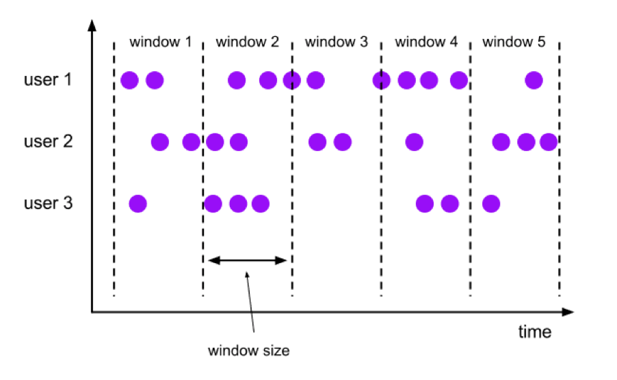
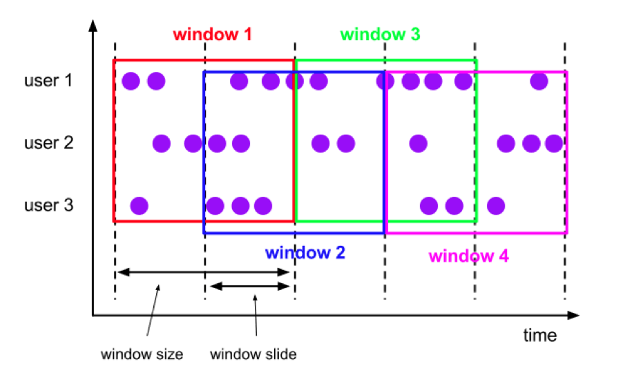

# Basics

For Stream processing and hence for dagger user must know about some basic concepts and terminologies before using it. Listing some of the important terms and keywords related to dagger/stream processing which will solidify your understanding and help you get started with Dagger.

## Terminologies

### Stream Processing

`Stream processing` commonly known as `Real-Time processing` lets users process and query continuous streams of unbounded Data which is Kafka events for Dagger.

### Streams

A group of Kafka topics sharing the same schema define a stream. The schema is defined using [`protobuf`](https://developers.google.com/protocol-buffers). You can have any number of schemas you want but the streaming queries become more complex with the addition of new schemas.

### Apache Flink

Apache Flink is a framework and distributed processing engine for processing over unbounded and bounded data streams. Flink works as the underlying layer of Dagger. Find more information about Flink [here](https://flink.apache.org/).

### Time Series Database

A time-series database [(TSDB)](https://www.influxdata.com/time-series-database/) is a database optimized for time-stamped or time-series data. Time series data are simply measurements or events that are tracked, monitored, down-sampled, and aggregated over time. Dagger platform used InfluxDB, a Time Series Database as one of its sink for Analytical use cases.

### Protobuf

[Protocol buffer or Protobuf](https://developers.google.com/protocol-buffers) is a serialization mechanism for structured data. It’s
well optimized to be transferred via the network. Dagger supports processing Data which is in Protobuf format.

### Parallelism

Dagger uses Flink for Distributed Data processing in scale. [Slots/Parallelism](https://ci.apache.org/projects/flink/flink-docs-master/docs/dev/execution/parallel/) is the Flink’s unit for Parallel Processing Data which provides an efficient way to horizontally scale up your job.

### Dagger Queries

Dagger supports Streaming SQL support on streams which we call Dagger Queries. These queries are similar to standard ANSI SQL with some more additional syntax.

### Function

Dagger supports some SQL functions out of the box to be used in the queries. Most Apache Calcite supported functions are supported in Dagger with the exceptions of some functions. Flink also supports some generic functions.

### User Defined Functions(UDF)

If Calcite and Flink do not support your desired function, it is pretty easy to expose new custom functions to Dagger which we call User Defined Functions. [List of supported UDFs](https://github.com/odpf/dagger/tree/main/docs/reference/udfs.md) in Dagger.

### Windowing

[Time Windows](https://flink.apache.org/news/2015/12/04/Introducing-windows.html) are at the heart of processing infinite streams. As Data being ingested to streams are unbounded and infinite, time windows provide a mechanism to split the stream into “buckets” of finite size, over which we can apply computations.

Dagger provides two different types of windows

- Hop/Tumbling Windows

  Each element to a window of specified window size. Tumbling windows have a fixed size and do not overlap. For example, if you specify a tumbling window with a size of 5 minutes, the current window will be evaluated and a new window will be started every five minutes as illustrated by the following figure. (image credit: [Flink Operators](https://ci.apache.org/projects/flink/flink-docs-release-1.9/dev/stream/operators/windows.html))
  

- Sliding Windows

  Each element gets assigned to windows of fixed length. An additional window slide parameter controls how frequently a sliding window is started. Hence, sliding windows can be overlapping if the slide is smaller than the window size. In this case, elements are assigned to multiple windows. (image credit: [Flink Operators](https://ci.apache.org/projects/flink/flink-docs-release-1.9/dev/stream/operators/windows.html))
  

### Rowtime

Rowtime is the time attribute field in your Data streams on which you can run your time windowed aggregations. You can configure this while creating a Dagger. Rowtime is the one of the time definition fields in input schema on which Dagger does all time it's time-base Operations. Read [here](https://ci.apache.org/projects/flink/flink-docs-release-1.9/zh/dev/table/streaming/time_attributes.html) on time attributes.
